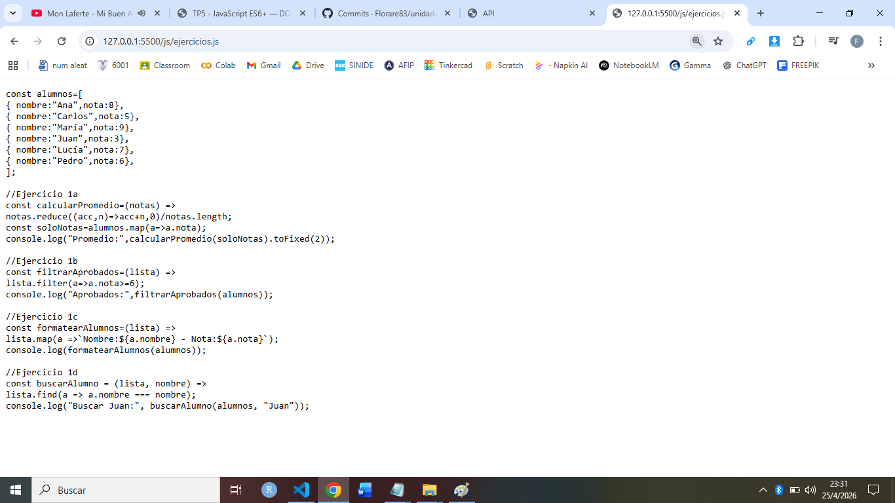
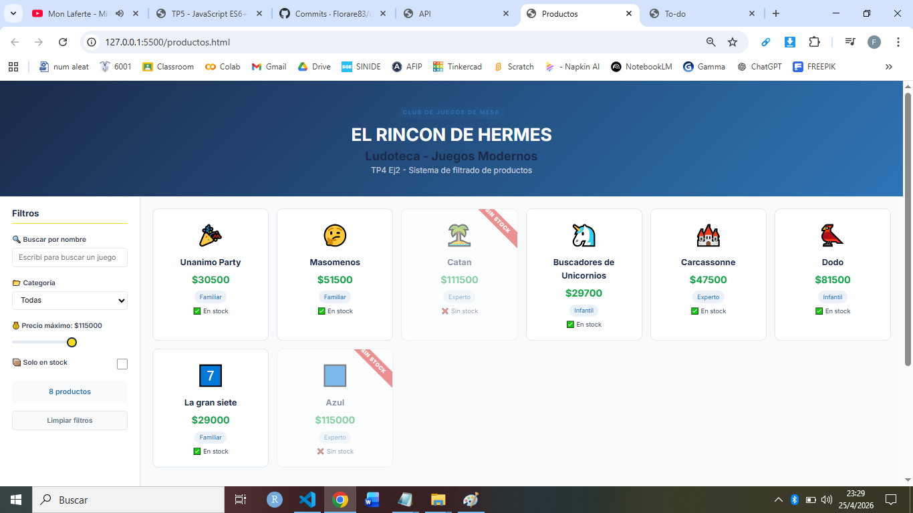
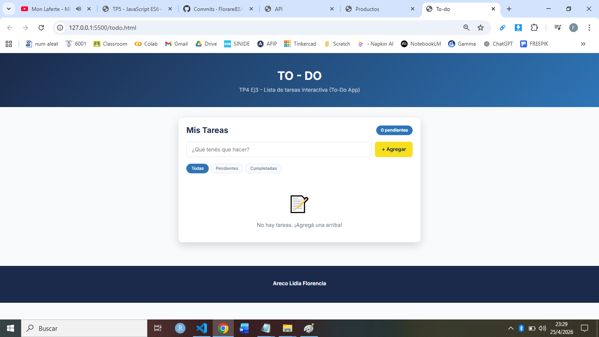

Nombre del proyecto:
JavaScript ES6+ —
DOM, Eventos y APIs

Descripción de cada página:
    Productos: Se trata de una página que posee un sistema de filtrado interactivo de productos.
    Todo: Es una página web que permite agregar, eliminar, contar y completar una lista interactiva de tareas.
    Api-demo: Esta página permite listar, visualizar y buscar tarjetas con elementos sobre un tema específico, en este caso "Razas de gatos" a partir de una API pública.

Tecnologías usadas: 
    * HTML5
    * CSS3
    * JavaScript ES6+
    * Fetch API

API elegida: The Cat API 
(https://thecatapi.com/)

Capturas:
* Ejercicios JS:

* Productos:

* To-Do:

API:
(images/api.png)

GitHub Pages: 
https://florare83.github.io/unidad2/

Instrucciones para clonar un repositorio:
1) Copiar la URL del repositorio.
2) En la Terminal de Vs Code ingresar a la carpeta donde se guardará el clon.
3) Ejecutar el siguiente comando incluyendo la url copiada: git clone https://github.com/Florare83/unidad2

Instrucciones para ejecutar con Live Server:
1) Instalar la extensión Live Server en VS Code
2) Hacer clic derecho sobre el archivo a abrir
3) Elegir la opción “Open with Live Server”

